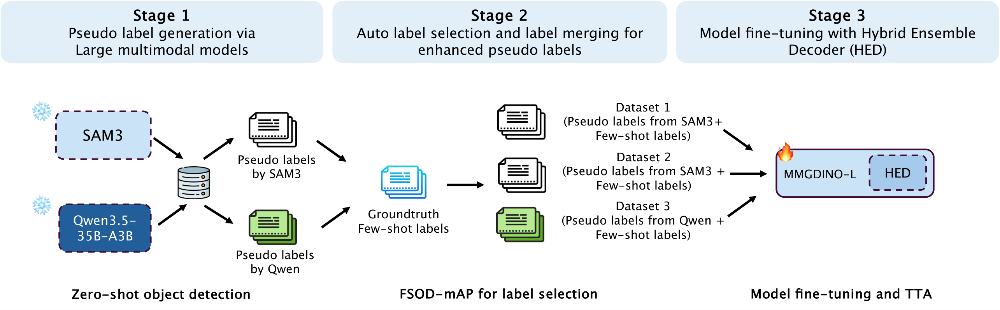

## NTIRE 2026 CDFSOD Challenge — Intellindust AI Lab solution

This folder contains Intellindust AI Lab solution at [NTIRE 2026 CDFSOD Challenge](https://www.codabench.org/competitions/12873/): 

**ZAP: Boosting Few-shot Object Detection with Auto-selected Zero-shot Pseudo Labels**


## Overview



We generate pseudo-labels for three datasets in a **zero-shot manner** using **Qwen3.5-35B-A3B** and **SAM3**, where only class-name text prompts are provided as input.

To automatically select more reliable pseudo-labels for each dataset, we propose a metric termed **FSOD-mAP**:

- We compute the IoU between pseudo-labels and the few-shot ground-truth boxes (1/5/10-shot).
- Predictions with IoU ≤ 0.3 (with matching class labels) are filtered out to suppress noisy false positives.
- We compute mAP on the remaining predictions as a proxy for pseudo-label quality.
- Based on FSOD-mAP, we select the pseudo-label source with higher quality:
  - Dataset1 and Dataset2: SAM3 is preferred
  - Dataset3: Qwen3.5 is preferred

Next, on the training set, we merge pseudo-labels with the few-shot ground-truth annotations:
- For SAM3 pseudo-labels, we additionally drop predictions with confidence score < 0.8 (Qwen3.5 does not provide confidence scores so all predictions are kept).
- To avoid redundancy, pseudo-labels that have IoU > 0.8 with a ground-truth box of the same class are removed.

We explore two strategies to construct training/validation sets:

- **Split Strategy 1**: Split the merged dataset (pseudo-labels + few-shot annotations) into train/validation with an 8:2 ratio.
- **Split Strategy 2** (is only for the challenge but not suitable in real-world applications): The complete merged dataset is regarded as the training set. The pseudo-labels generated on the original test set (no fusion due to missing GT) and the corresponding test images are taken as the validation set.

Then, we fine-tune the **MMGroundingDINO-L** models with the proposed **Hybrid Ensemble Decoder (HED)**.

During inference, we apply test-time augmentation (TTA) with horizontal flipping and Soft-NMS for each individual model (only at this challenge but on the standard benchmarks). Finally, predictions from the two models (trained under the two split strategies) are combined using Soft-NMS to produce the final results.


## Procedures

The following steps aim at reproducing the NTIRE challenge results. The fine-tuning procedures and hyper-parameters are exactly same as the ones used in RF100-VL experiments of the main paper.

#### 0) Generate pseudo-labels

After downloading the checkpoints of Qwen3.5-35B-A3B and SAM3 (or the latest SAM3.1), you can generate pseudo-labels by using the code in `Pseudo-Label-Generation/`:
```
cd Pseudo-Label-Generation/qwen_labeling
bash run_qwen.sh
cd Pseudo-Label-Generation/sam3_labeling
bash run_sam3.sh
```
You might have to adjust the dataset path and model path in the scripts.

#### 1) Download bert-base-uncased, pre-trained weights and train models

- Download bert-base-uncased and nltk_data following this [instruction](bert-base-uncased)

- Download pre-trained weight from: [MMGDINO-L](https://download.openmmlab.com/mmdetection/v3.0/mm_grounding_dino/grounding_dino_swin-l_pretrain_all/grounding_dino_swin-l_pretrain_all-56d69e78.pth)

- Adjust the dataset path and pre-trained weight path in `src_path.py`

- Run the training scripts (scripts below are under `FT-FSOD/`): `run_mmgdinol_traineval_cdfsodchallenge26_dataset123_1510shot_*.sh`. Each script will fine-tune the model and run evaluation/inference according to its configuration.

#### 2) Convert MMDet pickle predictions to COCO JSON

After inference, MMDetection typically outputs predictions in pickle format. Convert them to COCO JSON by running `pickle_to_coco.sh`. This produces COCO-style JSON predictions for downstream ensembling.

#### 3) Ensemble the two split-strategy models with Soft-NMS

Ensemble the predictions from the two models (trained under the two split strategies) using Soft-NMS: `softnms.sh`.

#### 4) Locate final results

The final ensembled prediction files will be saved under: `FT-FSOD/softnms_results/`

## Acknowledgments

- **SAM 3**: [facebookresearch/sam3](https://github.com/facebookresearch/sam3)
- **Qwen3.5**: [QwenLM/Qwen3.5](https://github.com/QwenLM/Qwen3.5)
- **MMGroundingDINO (MMDetection config)**: [open-mmlab/mmdetection `configs/mm_grounding_dino`](https://github.com/open-mmlab/mmdetection/)


